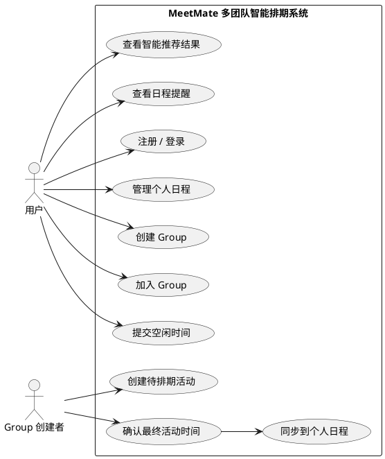

# MeetMate 多团队智能排期系统 软件开发文档

## 1. 项目名称

MeetMate 多团队智能排期系统  
MeetMate Multi-Group Smart Scheduling System

---

## 2. 项目定位

本项目是一个面向小组、社团、项目组、工作团队、朋友聚会等多人协作场景的智能排期网页应用。

用户登录后，可以管理自己的个人日程，也可以加入多个 Group。每个 Group 内可以创建活动、收集成员空闲时间，并由系统自动计算最适合所有成员的活动时间段。

本项目不强调校园属性，既可以用于课程小组讨论，也可以用于企业会议、项目评审、社团活动、线上会议和多人聚会。

---

## 3. 项目背景

多人协作中，经常出现“找时间困难”的问题。

例如：

- 项目组需要找所有成员都有空的讨论时间。
- 工作团队需要安排周会、评审会、头脑风暴。
- 社团或兴趣小组需要组织活动，但成员时间分散。
- 朋友聚会需要统计大家的空闲时间。
- 一个用户可能同时属于多个团队，容易出现日程冲突。

传统方式通常依赖微信群、QQ群、Excel 表格或人工询问，存在以下问题：

1. 信息分散，难以统一整理。
2. 成员回复格式不一致。
3. 人工统计效率低。
4. 很难直观看出哪个时间段最合适。
5. 排好的活动容易和个人日程冲突。
6. 多个 Group 的活动之间容易互相覆盖。

因此，本项目设计一个轻量化的多人智能排期系统，将个人日程管理、Group 协作和智能排期结合起来，提高多人时间协调效率。

---

## 4. 项目目标

开发一个简洁、美观、可运行的网页系统，实现以下目标：

1. 用户可以注册和登录。
2. 用户拥有个人主页。
3. 用户可以管理自己的个人日程。
4. 用户可以创建或加入多个 Group。
5. 一个用户可以加入多个 Group。
6. Group 内可以创建待排期活动。
7. Group 成员可以提交自己的空闲时间。
8. 系统可以自动计算推荐时间段。
9. 系统可以显示推荐理由和冲突情况。
10. 系统可以将确定后的 Group 活动同步到成员个人日程中。
11. 系统可以在个人主页显示近期日程提醒。
12. 系统界面简洁、清爽，类似 ChatGPT 的舒适风格。

---

## 5. 技术选型

## 5.1 推荐技术栈

本项目使用：

```txt
Python + Streamlit + SQLite
```

原因：

1. 开发速度快，适合短周期课程项目。
2. Streamlit 可以快速构建网页界面。
3. SQLite 轻量，不需要额外安装数据库服务器。
4. Python 适合实现排期算法和数据处理。
5. 项目结构简单，便于展示软件工程流程。

---

## 5.2 可选升级技术栈

如果开发时间充足，可以升级为：

```txt
Vue + FastAPI + SQLite
```

但课程项目建议优先完成 Streamlit 版本，保证功能稳定可演示。

---

## 6. 界面风格要求

页面整体风格参考 ChatGPT 的简洁风格：

1. 白色或浅灰色背景。
2. 大面积留白。
3. 卡片式内容区域。
4. 字体清晰，不使用复杂装饰。
5. 按钮颜色统一。
6. 页面层级明确。
7. 不做花哨动画。
8. 操作路径尽量短。
9. 重要信息用简洁的标签、表格、提示框展示。

### 6.1 页面布局要求

建议使用左侧导航栏 + 主内容区域。

左侧导航栏包含：

```txt
首页
个人日程
我的 Group
智能排期
设置
退出登录
```

主区域根据用户选择展示不同页面。

---

## 7. 用户角色

本项目 MVP 阶段只需要两类角色。

### 7.1 普通用户

普通用户可以：

1. 注册账号。
2. 登录系统。
3. 编辑个人信息。
4. 添加、修改、删除个人日程。
5. 创建 Group。
6. 加入 Group。
7. 查看自己加入的 Group。
8. 在 Group 中提交空闲时间。
9. 查看智能排期结果。
10. 接收 Group 活动同步到个人日程。

### 7.2 Group 创建者

Group 创建者本质上也是普通用户，但在自己创建的 Group 中拥有更多权限：

1. 修改 Group 名称和描述。
2. 创建 Group 活动。
3. 查看成员空闲时间统计。
4. 确认最终活动时间。
5. 删除 Group 活动。

---

## 8. 核心业务流程

## 8.1 用户注册登录流程

1. 用户进入系统。
2. 如果没有账号，点击注册。
3. 输入用户名、密码、昵称。
4. 系统保存用户信息。
5. 用户登录。
6. 登录成功后进入个人主页。

MVP 阶段密码必须使用哈希存储，不要明文保存。

---

## 8.2 个人日程管理流程

1. 用户登录后进入个人页面。
2. 用户添加个人日程。
3. 日程字段包括：
   - 标题
   - 日期
   - 开始时间
   - 结束时间
   - 地点
   - 备注
   - 类型：个人 / Group
4. 用户可以查看日程列表。
5. 用户可以修改或删除个人日程。
6. 系统按日期和时间排序展示。

---

## 8.3 Group 管理流程

1. 用户可以创建 Group。
2. 创建 Group 时填写：
   - Group 名称
   - Group 描述
   - Group 类型
3. 用户可以查看自己加入的 Group。
4. 用户可以通过邀请码加入 Group。
5. 一个用户可以加入多个 Group。
6. 一个 Group 可以有多个成员。

---

## 8.4 Group 活动创建流程

1. Group 创建者进入某个 Group。
2. 创建一个待排期活动。
3. 填写活动信息：
   - 活动名称
   - 活动说明
   - 候选日期范围
   - 候选时间范围
   - 活动时长
   - 地点
4. 系统生成候选时间段。
5. Group 成员提交自己在候选时间段的空闲情况。
6. 系统计算推荐时间。
7. Group 创建者确认最终时间。
8. 系统将该活动同步到相关成员个人日程。

---

## 8.5 智能排期流程

系统收集以下信息：

1. 活动候选时间段。
2. Group 成员提交的可用时间。
3. 成员个人日程中已有的占用时间。
4. 活动所需时长。

系统对每个候选时间段进行评分，并推荐得分最高的时间段。

---

## 9. 核心功能需求

## 9.1 注册功能

用户输入：

```txt
用户名
密码
昵称
```

系统要求：

1. 用户名不能为空。
2. 密码不能为空。
3. 用户名不能重复。
4. 注册成功后提示用户登录。
5. 密码使用哈希保存。

---

## 9.2 登录功能

用户输入：

```txt
用户名
密码
```

系统要求：

1. 校验用户名和密码。
2. 登录成功后进入首页。
3. 登录状态使用 Streamlit session state 保存。
4. 未登录用户不能访问核心页面。

---

## 9.3 个人主页

个人主页显示：

1. 用户昵称。
2. 今日日期。
3. 今日个人日程。
4. 即将开始的 Group 活动。
5. 用户加入的 Group 数量。
6. 本周待参加活动数量。
7. 简短欢迎语。

示例：

```txt
你好，张三

今日安排：
09:00 - 10:00 高数复习
14:00 - 15:30 项目讨论会

你当前加入了 3 个 Group
本周共有 5 个待参加活动
```

---

## 9.4 个人日程管理

用户可以添加日程。

字段：

```txt
标题
日期
开始时间
结束时间
地点
备注
类型
```

功能：

1. 新增日程。
2. 查看日程。
3. 删除日程。
4. 按日期筛选日程。
5. 显示与 Group 活动冲突的提醒。

---

## 9.5 Group 创建功能

用户可以创建 Group。

字段：

```txt
Group 名称
Group 描述
Group 类型
```

Group 类型可以是：

```txt
学习小组
工作团队
项目组
社团组织
朋友聚会
其他
```

系统创建 Group 后自动生成邀请码。

邀请码可以是 6 位随机字符串，例如：

```txt
A7K29Q
```

---

## 9.6 加入 Group 功能

用户输入邀请码后加入 Group。

要求：

1. 邀请码存在。
2. 用户不能重复加入同一个 Group。
3. 加入成功后可以在“我的 Group”中看到该 Group。

---

## 9.7 Group 首页

进入某个 Group 后，显示：

1. Group 名称。
2. Group 描述。
3. 邀请码。
4. 成员列表。
5. 当前待排期活动。
6. 已确认活动。
7. 创建新活动按钮。

---

## 9.8 创建待排期活动

Group 创建者可以创建活动。

字段：

```txt
活动名称
活动说明
候选开始日期
候选结束日期
每日候选开始时间
每日候选结束时间
活动时长
地点
备注
```

示例：

```txt
活动名称：项目需求讨论
候选日期：2026-06-11 至 2026-06-13
候选时间：19:00 至 22:00
活动时长：60 分钟
地点：线上会议
```

系统根据这些信息自动生成候选时间段。

例如生成：

```txt
2026-06-11 19:00-20:00
2026-06-11 20:00-21:00
2026-06-11 21:00-22:00
2026-06-12 19:00-20:00
...
```

---

## 9.9 成员空闲时间提交

Group 成员进入活动页面后，可以看到所有候选时间段。

成员可以对每个时间段选择：

```txt
有空
不确定
没空
```

评分规则：

```txt
有空 = 1
不确定 = 0.5
没空 = 0
```

---

## 9.10 个人日程冲突检测

系统在排期时，需要检查用户已有个人日程。

如果某个候选时间段和用户个人日程冲突，即使用户没有主动填写“没空”，系统也应视为冲突或降低评分。

冲突规则：

两个时间段发生重叠，则认为冲突。

例如：

```txt
已有日程：2026-06-12 19:30-20:30
候选时间：2026-06-12 19:00-20:00
```

这两个时间段重叠，因此存在冲突。

---

## 9.11 智能排期算法

系统对每个候选时间段计算综合得分。

### 9.11.1 基础评分

对每个候选时间段：

```txt
基础得分 = 有空人数 × 1 + 不确定人数 × 0.5 + 没空人数 × 0
```

### 9.11.2 冲突惩罚

如果某成员个人日程与候选时间段冲突，则对该时间段进行惩罚。

```txt
冲突惩罚 = 冲突人数 × 1
```

### 9.11.3 最终得分

```txt
最终得分 = 基础得分 - 冲突惩罚
```

### 9.11.4 推荐规则

系统按最终得分从高到低排序。

如果多个时间段得分相同，优先选择：

1. 冲突人数更少的时间段。
2. 有空人数更多的时间段。
3. 日期更早的时间段。
4. 时间更早的时间段。

### 9.11.5 推荐结果展示

系统展示：

```txt
推荐时间：2026-06-12 20:00-21:00
综合得分：4.5
有空人数：4
不确定人数：1
没空人数：0
个人日程冲突人数：0
推荐理由：多数成员有空，且没有检测到个人日程冲突。
```

---

## 9.12 活动确认功能

Group 创建者可以在推荐结果中选择一个时间段并确认活动。

确认后：

1. 活动状态从“待排期”变为“已确认”。
2. 系统记录最终时间。
3. 系统将该活动同步到所有 Group 成员的个人日程。
4. 个人日程类型标记为 Group。
5. Group 首页显示该活动为已确认。

---

## 9.13 日程提醒功能

MVP 阶段不需要真正发送短信、邮件或系统通知。

只需要在个人主页显示“即将开始”的活动。

规则：

```txt
当前时间之后 24 小时内开始的日程，显示在提醒区域。
```

示例：

```txt
即将开始：
今晚 20:00 项目讨论会
明天 09:00 小组汇报彩排
```

---

## 10. 页面设计

## 10.1 登录页

页面元素：

1. 系统名称：MeetMate
2. 副标题：让多人排期更简单
3. 登录表单
4. 注册入口

界面风格：

```txt
居中卡片
白色背景
圆角输入框
简洁按钮
```

---

## 10.2 注册页

页面元素：

1. 用户名输入框。
2. 密码输入框。
3. 昵称输入框。
4. 注册按钮。
5. 返回登录按钮。

---

## 10.3 首页 / 个人主页

页面元素：

1. 欢迎语。
2. 今日安排卡片。
3. 即将开始活动卡片。
4. 我的 Group 概览。
5. 快捷入口：
   - 添加个人日程
   - 创建 Group
   - 加入 Group
   - 进入智能排期

---

## 10.4 个人日程页

页面元素：

1. 添加日程表单。
2. 日程列表。
3. 日期筛选。
4. 删除按钮。
5. 日程冲突提示。

---

## 10.5 我的 Group 页

页面元素：

1. 我创建的 Group。
2. 我加入的 Group。
3. 创建 Group 表单。
4. 加入 Group 表单。
5. Group 卡片列表。

Group 卡片显示：

```txt
Group 名称
Group 类型
成员数量
待排期活动数量
进入 Group 按钮
```

---

## 10.6 Group 详情页

页面元素：

1. Group 基本信息。
2. 成员列表。
3. 邀请码。
4. 待排期活动列表。
5. 已确认活动列表。
6. 创建活动入口。

---

## 10.7 活动排期页

页面元素：

1. 活动基本信息。
2. 候选时间段列表。
3. 成员空闲时间提交区域。
4. 智能推荐按钮。
5. 推荐结果表格。
6. 确认活动按钮。

---

## 11. 数据库设计

数据库使用 SQLite。

## 11.1 users 表

```sql
CREATE TABLE users (
    id INTEGER PRIMARY KEY AUTOINCREMENT,
    username TEXT UNIQUE NOT NULL,
    password_hash TEXT NOT NULL,
    nickname TEXT NOT NULL,
    created_at TEXT NOT NULL
);
```

---

## 11.2 groups 表

```sql
CREATE TABLE groups (
    id INTEGER PRIMARY KEY AUTOINCREMENT,
    name TEXT NOT NULL,
    description TEXT,
    group_type TEXT,
    invite_code TEXT UNIQUE NOT NULL,
    owner_id INTEGER NOT NULL,
    created_at TEXT NOT NULL,
    FOREIGN KEY(owner_id) REFERENCES users(id)
);
```

---

## 11.3 group_members 表

```sql
CREATE TABLE group_members (
    id INTEGER PRIMARY KEY AUTOINCREMENT,
    group_id INTEGER NOT NULL,
    user_id INTEGER NOT NULL,
    role TEXT NOT NULL,
    joined_at TEXT NOT NULL,
    UNIQUE(group_id, user_id),
    FOREIGN KEY(group_id) REFERENCES groups(id),
    FOREIGN KEY(user_id) REFERENCES users(id)
);
```

role 可取：

```txt
owner
member
```

---

## 11.4 personal_events 表

```sql
CREATE TABLE personal_events (
    id INTEGER PRIMARY KEY AUTOINCREMENT,
    user_id INTEGER NOT NULL,
    title TEXT NOT NULL,
    event_date TEXT NOT NULL,
    start_time TEXT NOT NULL,
    end_time TEXT NOT NULL,
    location TEXT,
    note TEXT,
    event_type TEXT NOT NULL,
    source_group_id INTEGER,
    source_activity_id INTEGER,
    created_at TEXT NOT NULL,
    FOREIGN KEY(user_id) REFERENCES users(id)
);
```

event_type 可取：

```txt
personal
group
```

---

## 11.5 group_activities 表

```sql
CREATE TABLE group_activities (
    id INTEGER PRIMARY KEY AUTOINCREMENT,
    group_id INTEGER NOT NULL,
    title TEXT NOT NULL,
    description TEXT,
    candidate_start_date TEXT NOT NULL,
    candidate_end_date TEXT NOT NULL,
    daily_start_time TEXT NOT NULL,
    daily_end_time TEXT NOT NULL,
    duration_minutes INTEGER NOT NULL,
    location TEXT,
    note TEXT,
    status TEXT NOT NULL,
    final_date TEXT,
    final_start_time TEXT,
    final_end_time TEXT,
    created_by INTEGER NOT NULL,
    created_at TEXT NOT NULL,
    FOREIGN KEY(group_id) REFERENCES groups(id),
    FOREIGN KEY(created_by) REFERENCES users(id)
);
```

status 可取：

```txt
pending
confirmed
cancelled
```

---

## 11.6 availability 表

```sql
CREATE TABLE availability (
    id INTEGER PRIMARY KEY AUTOINCREMENT,
    activity_id INTEGER NOT NULL,
    user_id INTEGER NOT NULL,
    slot_start TEXT NOT NULL,
    slot_end TEXT NOT NULL,
    status TEXT NOT NULL,
    created_at TEXT NOT NULL,
    UNIQUE(activity_id, user_id, slot_start, slot_end),
    FOREIGN KEY(activity_id) REFERENCES group_activities(id),
    FOREIGN KEY(user_id) REFERENCES users(id)
);
```

status 可取：

```txt
available
maybe
unavailable
```

---

## 12. 推荐项目结构

```txt
meetmate/
│
├── app.py
├── database.py
├── auth.py
├── models.py
├── scheduler.py
├── ui_helpers.py
├── requirements.txt
├── README.md
├── test_cases.md
└── docs/
    ├── database_design.md
    ├── usecase.puml
    └── project_plan_notes.md
```

---

## 13. 模块职责

## 13.1 app.py

负责：

1. Streamlit 页面入口。
2. 页面导航。
3. 调用各模块功能。
4. 控制登录状态。
5. 展示主要界面。

---

## 13.2 database.py

负责：

1. 创建数据库连接。
2. 初始化所有数据表。
3. 封装基础数据库操作。
4. 提供查询函数。

---

## 13.3 auth.py

负责：

1. 用户注册。
2. 用户登录。
3. 密码哈希。
4. 登录状态检查。

---

## 13.4 models.py

负责：

1. 用户数据操作。
2. Group 数据操作。
3. 日程数据操作。
4. 活动数据操作。
5. 空闲时间数据操作。

---

## 13.5 scheduler.py

负责：

1. 生成候选时间段。
2. 判断时间冲突。
3. 计算排期得分。
4. 生成推荐结果。
5. 生成推荐理由。

---

## 13.6 ui_helpers.py

负责：

1. 页面样式。
2. 卡片组件。
3. 表格格式化。
4. 提示信息展示。
5. 日期时间格式化。

---

## 14. 核心算法设计

## 14.1 候选时间段生成算法

输入：

```txt
候选开始日期
候选结束日期
每日开始时间
每日结束时间
活动时长
```

输出：

```txt
候选时间段列表
```

示例：

输入：

```txt
2026-06-11 至 2026-06-13
19:00 至 22:00
活动时长 60 分钟
```

输出：

```txt
2026-06-11 19:00-20:00
2026-06-11 20:00-21:00
2026-06-11 21:00-22:00
2026-06-12 19:00-20:00
...
```

---

## 14.2 时间冲突判断算法

两个时间段：

```txt
A: start_a, end_a
B: start_b, end_b
```

如果满足：

```txt
start_a < end_b 且 start_b < end_a
```

则认为两个时间段冲突。

---

## 14.3 智能排期评分算法

对每个候选时间段：

```txt
available_score = available_count * 1
maybe_score = maybe_count * 0.5
unavailable_score = unavailable_count * 0
conflict_penalty = conflict_count * 1

final_score = available_score + maybe_score + unavailable_score - conflict_penalty
```

排序规则：

```txt
1. final_score 越高越好
2. conflict_count 越低越好
3. available_count 越高越好
4. 时间越早越好
```

---

## 15. 测试用例

## 15.1 注册测试

输入：

```txt
用户名：test01
密码：123456
昵称：测试用户
```

预期：

```txt
注册成功，数据库 users 表新增记录。
```

---

## 15.2 登录测试

输入：

```txt
用户名：test01
密码：123456
```

预期：

```txt
登录成功，进入个人主页。
```

---

## 15.3 创建 Group 测试

输入：

```txt
Group 名称：工程概论项目组
Group 类型：项目组
Group 描述：用于课程项目排期
```

预期：

```txt
创建成功，生成邀请码，创建者自动加入 Group。
```

---

## 15.4 加入 Group 测试

输入：

```txt
邀请码：系统生成的邀请码
```

预期：

```txt
用户成功加入对应 Group。
```

---

## 15.5 添加个人日程测试

输入：

```txt
标题：Java 作业
日期：2026-06-12
开始时间：19:30
结束时间：20:30
```

预期：

```txt
日程添加成功，并在个人日程列表中显示。
```

---

## 15.6 创建待排期活动测试

输入：

```txt
活动名称：项目讨论会
候选日期：2026-06-12 至 2026-06-13
候选时间：19:00 至 22:00
活动时长：60 分钟
```

预期：

```txt
系统生成多个候选时间段。
```

---

## 15.7 成员提交空闲时间测试

输入：

```txt
用户 A：2026-06-12 19:00 有空，20:00 没空
用户 B：2026-06-12 19:00 有空，20:00 有空
用户 C：2026-06-12 19:00 不确定，20:00 有空
```

预期：

```txt
系统保存每个成员对候选时间段的选择。
```

---

## 15.8 智能排期测试

输入：

```txt
多个成员的空闲时间数据
```

预期：

```txt
系统按综合得分排序，推荐最合适的时间段。
```

---

## 15.9 个人日程冲突测试

已有个人日程：

```txt
2026-06-12 19:30-20:30 Java 作业
```

候选时间：

```txt
2026-06-12 19:00-20:00
```

预期：

```txt
系统识别该候选时间与个人日程冲突，并降低该时间段得分。
```

---

## 15.10 确认活动测试

操作：

```txt
Group 创建者选择推荐时间并点击确认活动。
```

预期：

```txt
活动状态变为已确认，并同步到成员个人日程。
```

---

## 16. README.md 要求

README.md 需要包含：

1. 项目简介。
2. 项目背景。
3. 核心功能。
4. 技术栈。
5. 安装方法。
6. 运行方法。
7. 项目结构。
8. 数据库设计简介。
9. 智能排期算法说明。
10. 测试用例说明。
11. 后续改进方向。

---

## 17. 运行方式

在项目根目录下执行：

```bash
pip install -r requirements.txt
streamlit run app.py
```

---

## 18. requirements.txt

至少包含：

```txt
streamlit
pandas
```

如需要图表，可加入：

```txt
matplotlib
```

MVP 阶段尽量减少依赖。

---

## 19. 后续改进方向

后续可以增加：

1. 日历视图。
2. 邮件提醒。
3. 手机端适配。
4. Group 权限管理。
5. 活动评论区。
6. 文件附件。
7. 日程导出为 ICS 文件。
8. 微信 / 企业微信 / 飞书通知。
9. AI 自动总结成员时间偏好。
10. 接入真实日历系统。
11. 多人实时协同刷新。
12. WebSocket 实时通知。

---

## 20. 项目开发计划书适配说明

本项目适合填入《项目开发计划书》，因为它具备完整的软件工程要素：

1. 有明确需求场景。
2. 有用户角色。
3. 有数据库设计。
4. 有模块划分。
5. 有核心算法。
6. 有测试用例。
7. 有进度计划。
8. 有风险控制。
9. 有可演示系统。
10. 有后续迭代空间。

---

## 21. 课堂展示重点

展示时重点说明：

1. 本项目解决的是多人协作中的时间协调问题。
2. 系统将个人日程和 Group 排期结合起来。
3. 用户可以加入多个 Group。
4. 系统能够自动检测个人日程冲突。
5. 智能排期算法会根据成员空闲情况和冲突情况推荐时间。
6. 最终确认的 Group 活动会同步到个人日程。
7. 项目体现了需求分析、系统设计、数据库设计、编码实现、测试验证等完整开发流程。

---

## 22. MVP 边界

必须完成：

1. 用户注册登录。
2. 个人主页。
3. 个人日程管理。
4. 创建 Group。
5. 加入 Group。
6. Group 详情页。
7. 创建待排期活动。
8. 成员提交空闲时间。
9. 智能排期推荐。
10. 确认活动并同步到个人日程。
11. SQLite 数据持久化。
12. README.md。
13. test_cases.md。

可以暂不完成：

1. 真实邮件通知。
2. 手机短信通知。
3. 第三方日历同步。
4. 复杂权限系统。
5. 文件上传。
6. 聊天功能。
7. 多人实时协同刷新。
8. 云端部署。

---

## 23. 用例图 PlantUML

请生成 `docs/usecase.puml`：



---

## 24. 开发注意事项

1. 请优先保证功能完整，不要过度追求复杂动画。
2. 页面尽量简洁，不要堆太多颜色。
3. 数据库初始化应在程序启动时自动完成。
4. 所有按钮操作需要有成功或失败提示。
5. 删除操作需要明确提示。
6. 日程开始时间必须早于结束时间。
7. 活动候选日期范围不能为空。
8. 活动时长必须大于 0。
9. 用户不能重复加入同一个 Group。
10. 用户不能重复注册相同用户名。
11. 确认活动时要避免重复同步到个人日程。
12. 系统所有文字使用中文。

---

## 25. Codex 执行指令

请你根据本 Markdown 文档，生成完整可运行项目。

生成内容包括：

1. `app.py`
2. `database.py`
3. `auth.py`
4. `models.py`
5. `scheduler.py`
6. `ui_helpers.py`
7. `requirements.txt`
8. `README.md`
9. `test_cases.md`
10. `docs/database_design.md`
11. `docs/usecase.puml`
12. `docs/project_plan_notes.md`

要求：

1. 项目使用 Python + Streamlit + SQLite。
2. 页面风格简洁，接近 ChatGPT 的清爽风格。
3. 所有页面使用中文。
4. 代码结构清晰。
5. 数据库自动初始化。
6. 登录状态使用 Streamlit session state 保存。
7. 密码不要明文保存，应使用哈希。
8. 一个用户可以加入多个 Group。
9. 一个 Group 可以有多个成员。
10. 智能排期需要考虑成员提交的空闲时间和个人日程冲突。
11. 确认 Group 活动后，需要同步到成员个人日程。
12. 项目必须可以通过以下命令运行：

```bash
pip install -r requirements.txt
streamlit run app.py
```

请优先保证功能完整、运行稳定、界面清楚，不要过度追求复杂样式。
